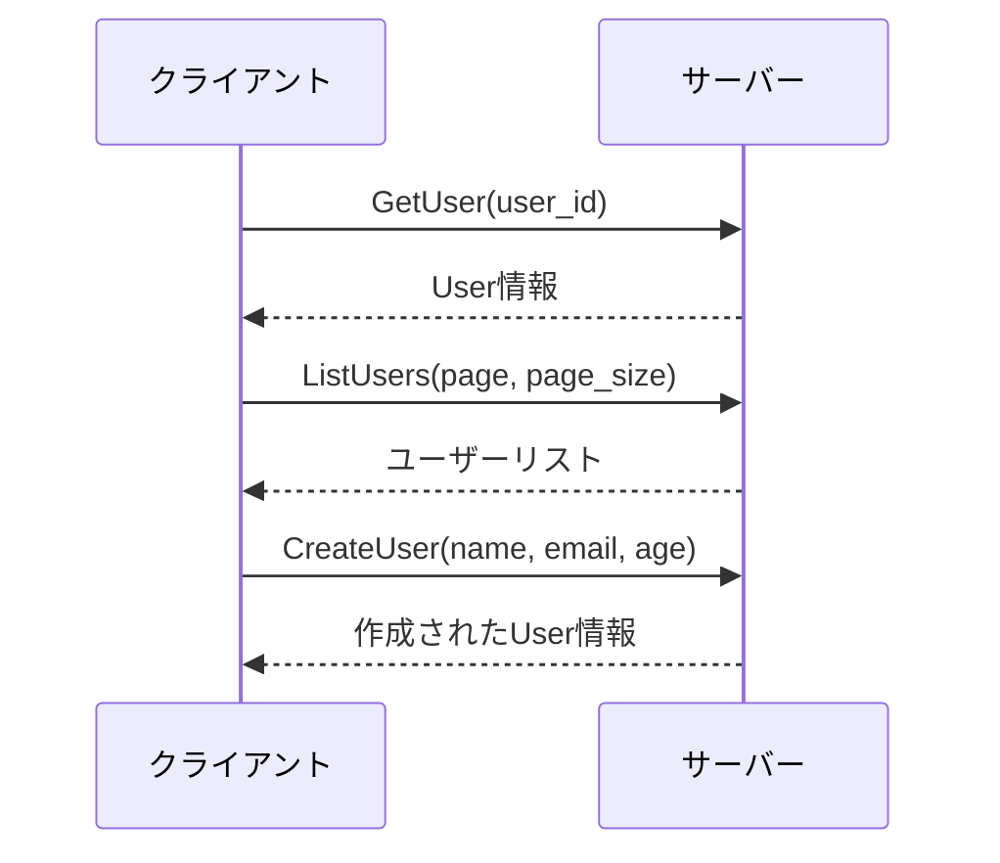

# 🚀 Go gRPC ユーザーサービス


シンプルかつパワフルなユーザー管理 API を**gRPC**で実装した参照アーキテクチャです。マイクロサービスアーキテクチャにおける効率的な通信方法の例として活用できます。

## ✨ 主な機能

- 👤 **ユーザー情報の取得** - ID による個別ユーザーの検索
- 📋 **ユーザー一覧の表示** - ページネーション機能付き
- ✏️ **ユーザーの新規作成** - バリデーション付き

## 🏗️ アーキテクチャ

```
├── 📁 proto           # サービス定義
│   └── 📄 user.proto  # Protocol Buffersによるインターフェース定義
├── 📁 server          # サーバー実装
│   └── 📄 main.go     # gRPCサーバー
└── 📁 client          # クライアント実装
    └── 📄 main.go     # gRPCクライアント
```

## 🔧 技術スタック

- **gRPC** - 高速な RPC（リモートプロシージャコール）フレームワーク
- **Protocol Buffers** - 言語中立的なデータ構造定義
- **Go 言語** - 効率的で並行処理に強いバックエンド言語
- **HTTP/2** - 多重化とストリーミングをサポートする通信プロトコル

## 🚀 はじめ方

### 前提条件

- Go 1.19 以上
- Protocol Buffers コンパイラ（protoc）
- Go 用の Protocol Buffers プラグイン

### 環境構築

1. **依存関係のインストール**

```bash
go mod tidy
```

2. **Protocol Buffers からのコード生成**

```bash
protoc --go_out=. --go_opt=paths=source_relative \
    --go-grpc_out=. --go-grpc_opt=paths=source_relative \
    proto/user.proto
```

### サーバーの起動

```bash
cd server
go run main.go
```

サーバーが起動すると、ポート 50051 で gRPC リクエストを待ち受けます。

### クライアントの実行

```bash
cd client
go run main.go
```

クライアントは各 API メソッドを呼び出し、結果を表示します。

## 📊 通信フロー図



## 🔍 gRPC の利点

- **高性能** - Protocol Buffers と HTTP/2 による効率的な通信
- **型安全** - コンパイル時に型チェック
- **多言語対応** - 様々なプログラミング言語で実装可能
- **双方向ストリーミング** - リアルタイム通信に最適
- **自動コード生成** - クライアント/サーバーコードを自動生成

## 🔮 拡張アイデア

- 🔒 **認証機能** - JWT や OAuth2 による認証の追加
- 📊 **データベース連携** - 実際の DB との接続
- 🔄 **ストリーミング API** - リアルタイム更新機能の実装
- 📝 **ロギング** - 詳細なリクエスト/レスポンスのロギング
- 📈 **メトリクス収集** - Prometheus によるパフォーマンスモニタリング
